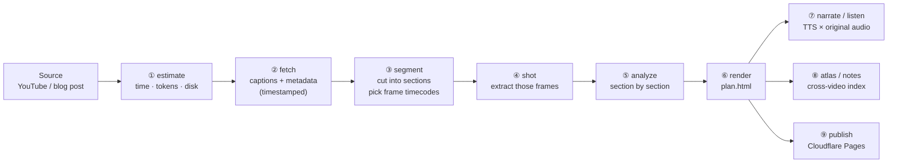

# How it works (technical)

**English** · [繁體中文](how-it-works.zh-TW.md)

> This is for people who want to know what happens inside. If you only want to use it, the [README](../README.md) is enough.

**A pipeline that turns long-form video into navigable text artifacts.** Give it a YouTube link and it pulls the source and timestamped captions, segments the video, extracts the frames worth looking at, analyses it section by section, and renders a linear-progression explainer page (`plan.html`). Every video then gets linked into one searchable index (`atlas.html`). If you'd rather listen, it muxes a narrated track from TTS narration and the speaker's own audio. Driven by an agent: **the skills make the judgment calls, the Python scripts do the fetching, frame extraction, muxing, validation and rendering.** Every stage is anchored to a timecode.

---

## The pipeline



### Who does what at each stage

| # | Stage | Judgment (skill) | Execution (script) | Output |
|---|---|---|---|---|
| ① | `estimate` | — | `estimate.py` + `config/estimate.yaml` | Per-stage time / token / disk estimate — **you know the cost before anything runs** |
| ② | `fetch` | Pick the caption language, work out the source type | `fetch.py` (`yt-dlp`), `blog.py` | `transcript.json` (line by line, timestamped), `meta.json` (chapters) |
| ③ | `segment` | **Cut into meaningful sections, pick the timecodes worth a screenshot, decide whether vision is needed** | `validate.py` checks the result | `segments.json` |
| ④ | `shot` | — | `screenshot.py` (one `yt-dlp` download + `ffmpeg -ss` per timecode) | `frames/s03_292.jpg` (filename = section number + seconds) |
| ⑤ | `analyze` | **Per section: what it builds on, the reasoning, the terms, the corrections, what it leaves for the next one** (linear progression is a hard rule) | `validate.py` checks schema + rules | `analysis.json` |
| ⑥ | `render` | Overview and ordering | `render.py` (Jinja2 + `templates/`) | `plan.html`: five fixed sections, every part linked back to its timecode |
| ⑦ | `narrate` / `listen` | Write the spoken script, pick the original-audio clips | `narrate.py` (edge-tts + `ffmpeg` for cutting, resampling and concat), `listen.py` | `lesson.mp3` (narration cut with original audio), `lesson.dub.mp3` (clips dubbed instead), `listen.html` (podcast page, karaoke script) |
| ⑧ | `atlas` / `notes` / `digest` / `canvas` | Link the videos, group them by topic, tag each item's PACER type, pick the concepts worth drawing | `atlas.py`, `notes.py`, `digest.py` | `atlas.html` (every video, its neighbours, topic regions, searchable), `notes.html`, `digest.html`, a tldraw canvas |
| ⑨ | `publish` | — | `publish.py` | `dist/`, deployable to Cloudflare Pages as is |

---

## Engineering decisions

**1. The timecode is the only glue.** Captions, sections, screenshot filenames, analysis, audio chapters and karaoke highlighting all hang off one timeline, so any piece of the output clicks back to that exact second of the source. An index you can't trace back to the original is an index nobody trusts.

**2. The muxed audio is deliberately constant bitrate (CBR 48k).** TTS narration and the `ffmpeg`-cut original clips are normalised to one sample rate (24 kHz / mono) before concat; the bitrate is fixed because **time and bytes have to stay linear for the browser to seek accurately** — with VBR the landing point drifts a second or two and the karaoke highlighting no longer lines up with the voice.

**3. Cost is estimated before anything runs.** Download bandwidth, the screenshot ceiling and the input/output tokens per section all live in `config/estimate.yaml`, so tuning the coefficients needs no code change. For a long video, look at the estimate before deciding whether to pay for vision.

**4. Everything an agent produces passes two checks.** `schemas/*.json` catches structural problems; `validate.py` catches the semantic hard rules (no forward references to later sections, a per-video ceiling on concept nodes, and so on). Nothing moves to the next stage until it passes.

**5. Rules are overridable without touching code.** Copy anything from `rules/`, `config/` or `templates/` into a `./learn.rules/` folder in your project and edit it there; `pacer paths` prints which copy of each rule is actually being read. Updates never overwrite your customisations.

**6. Every stage is its own CLI.** `pacer <stage>` runs or re-runs one stage on its own, and `pacer prune` reclaims the intermediate files that a re-run would recreate anyway.

---

## Output

```
workspace/<video title>/plan.html    # five fixed sections: outline → author's reasoning → section by section → summary → three next steps
workspace/<video title>/lesson.mp3   # the audio version (narration × original audio); lesson.json holds the chapter timeline
workspace/atlas.html                 # the index: every video, its neighbours (routes), topic regions, searchable
workspace/listen.html                # podcast page: docked player, karaoke script, remembers where you stopped
workspace/notes.html                 # the notes: each line links back to the section that said it
workspace/brain/                     # Obsidian vault (`pacer brain`): one file per video, one per concept, [[wikilink]]ed
dist/                                # the static site after publish
```

---

## Requirements

- A coding agent: [Claude Code](https://claude.com/claude-code), or any agent that reads `SKILL.md` (Cursor, Codex, Gemini CLI, OpenCode, Copilot …)
- [uv](https://docs.astral.sh/uv/) (installs the Python dependencies, `yt-dlp` included)
- `ffmpeg`: `sudo apt install ffmpeg` / `brew install ffmpeg`
- The audio version also needs a network connection (edge-tts, free, no key)

## Installing

**As a Claude Code plugin (works from any project folder)**

```
/plugin marketplace add https://github.com/TheWayToLearn/PACER-Learn
/plugin install pacer@thewaytolearn
```

Then, in any folder: `/pacer:learn https://youtu.be/...`. What you study is stored in that folder's `./workspace/` (or wherever `LEARN_WORKSPACE` points).

**Into any other agent**

```bash
npx skills add TheWayToLearn/PACER-Learn                           # the 14 SKILL.md files
uv tool install git+https://github.com/TheWayToLearn/PACER-Learn   # the `pacer` CLI they call
```

`npx skills add` only copies the instructions into wherever that agent keeps skills, so the second line is what brings the programs. Check it with `pacer paths`; `uvx --from git+https://github.com/TheWayToLearn/PACER-Learn pacer paths` runs it once without installing.

**From a clone**

```
git clone https://github.com/TheWayToLearn/PACER-Learn && cd PACER-Learn && uv sync
uv tool install -e .     # so `pacer …` resolves to this working copy
claude
```

Then `/learn https://youtu.be/...`. To cut down on permission prompts, add `"Bash(pacer *)"` to `permissions.allow` in `.claude/settings.json`.

## Commands

| Command | What it does |
|---|---|
| `/learn <url> [--shots auto\|none\|many] [--vision true\|false\|auto]` | The whole pipeline: ① → ⑨ |
| `/learn-estimate <url>` | Estimate time / tokens / disk only |
| `/learn-fetch` `/learn-segment` `/learn-shot` `/learn-analyze` | Re-run one stage (different caption language, different section breaks, different frames, different vision mode) |
| `/learn-render` | Rebuild `plan.html` only |
| `/learn-narrate` `/learn-listen` | Build the audio version, rebuild the podcast page |
| `/learn-atlas` `/learn-notes` `/learn-digest` `/learn-canvas` | The index, the notes, the PACER practice, the tldraw canvas |
| `/learn-publish` | Package `dist/` and deploy to Cloudflare Pages |

In Claude Code the plugin prefixes these with `/pacer:`.

## Development

```
uv run pytest -q    # 183 passed
pacer paths         # which copy of each rule / template is actually being read
pacer prune         # list the reclaimable intermediate files (add --delete to really delete)
```

The 14 skills live in `skills/`, the scripts they call in `scripts/` — `pacer <name>` runs any of them
(`scripts/cli.py` is the dispatcher, and `tests/test_cli.py` fails if a script or a SKILL.md drifts out
of sync). The structure of everything an agent writes is defined in `schemas/`, the semantic hard rules
in `rules/`.
