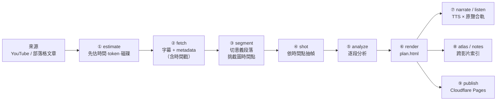

# 底層怎麼做的（技術版）

> 這份是給想知道內部怎麼跑的人。只想用的話看 [README](README.zh-TW.md)（[English](../README.md)）就夠了。

**一條把長影片變成可導覽文字成品的管線（pipeline）。** 給一支 YouTube 連結，它取源、切段、抽幀、逐段分析，產出線性推進的解析頁（plan.html），再把每支影片連成一份可搜尋的影片解析列表（atlas.html）；要用聽的，它會把 TTS 講解與作者原聲合成一軌。由 Claude Code 驅動：**skill 只負責判斷，Python script 負責抓取、截圖、合軌、驗證與排版。**

> **English**: a pipeline that turns long-form video into navigable text artifacts. It pulls the source and timestamped captions (`yt-dlp`), has an agent segment the video and pick the frames worth grabbing, extracts them (`ffmpeg`), analyses it segment by segment, renders an HTML explainer page, muxes a narrated audio version (edge-tts + original audio), and links every video into a searchable index. Skills make the judgment calls; Python scripts do the fetching, frame extraction, muxing, validation and rendering. Every stage is anchored to a timecode.

---

## 管線



### 每一階段誰做什麼

| # | 階段 | 判斷（skill） | 執行（script） | 產出 |
|---|---|---|---|---|
| ① | `estimate` | — | `estimate.py` ＋ `config/estimate.yaml` | 分階段的時間／token／磁碟預估，**跑之前就知道代價** |
| ② | `fetch` | 選字幕語言、判斷來源型別 | `fetch.py`（`yt-dlp`）、`blog.py` | `transcript.json`（逐句＋時間戳）、`meta.json`（章節） |
| ③ | `segment` | **切成意義段落、挑出值得截圖的時間點、決定要不要用 vision** | `validate.py` 驗結果 | `segments.json` |
| ④ | `shot` | — | `screenshot.py`（`yt-dlp` 下載一次 ＋ `ffmpeg -ss` 逐點抽幀） | `frames/s03_292.jpg`（檔名＝段號＋秒數） |
| ⑤ | `analyze` | **逐段寫承上／推理／術語／勘誤／留給下一段**（線性推進硬規則） | `validate.py` 驗 schema ＋ 規則 | `analysis.json` |
| ⑥ | `render` | 概覽與排序 | `render.py`（Jinja2 ＋ `templates/`） | `plan.html`：五段固定結構，每段掛回時間碼 |
| ⑦ | `narrate` / `listen` | 寫口語講稿、挑原聲片段 | `narrate.py`（edge-tts ＋ `ffmpeg` 切段、統一取樣率、concat）、`listen.py` | `lesson.mp3`（講解×原聲交錯）、`lesson.dub.mp3`（原聲換配音）、`listen.html`（podcast 頁、karaoke 講稿） |
| ⑧ | `atlas` / `notes` / `digest` / `canvas` | 連站、分主題、標記 PACER、挑要畫的概念 | `atlas.py`、`notes.py`、`digest.py` | `atlas.html`（各站／相鄰站／主題區，可搜尋）、`notes.html`、`digest.html`、tldraw 畫布 |
| ⑨ | `publish` | — | `publish.py` | `dist/`，可直接部署到 Cloudflare Pages |

---

## 工程上的幾個決定

**1. 時間碼（timecode）是唯一的黏著劑。** 字幕、段落、截圖檔名、分析段落、語音章節、karaoke 高亮全部掛在同一條時間軸上，任何一段成品都能點回原始素材的那一秒。索引做不到回溯，使用者就不會信它。

**2. 合出來的音檔刻意用固定位元率（CBR 48k）。** TTS 講解與 `ffmpeg` 切出的原聲先統一成同一個取樣率（24 kHz／mono）才 concat；位元率固定是因為**時間與位元組必須是線性關係，瀏覽器 seek 才精準**——用 VBR 的話落點會差一兩秒，karaoke 高亮就跟原聲對不上。

**3. 執行前先估成本。** 下載頻寬、截圖上限、每段的輸入／輸出 token 都寫在 `config/estimate.yaml`，改係數不用動程式。長影片先看估算再決定要不要跑 vision。

**4. agent 的產出一律過兩道驗證。** `schemas/*.json` 擋結構，`validate.py` 擋語意硬規則（例如「不准前向參照後面的段落」、一站的概念節點上限）。沒過不進下一階段。

**5. 規則可覆寫，不必改程式。** `rules/`、`config/`、`templates/` 可以複製到專案裡的 `./learn.rules/` 再改；`uv run scripts/paths.py` 會印出每個規則實際讀哪一份。plugin 更新不會蓋掉你的客製。

**6. 每個階段都是獨立 CLI。** `uv run scripts/<stage>.py` 可以單獨跑、單獨重跑；`prune.py` 回收「重跑就會再有」的中間檔。

---

## 產出

```
workspace/<影片標題>/plan.html    # 五段固定結構：前情提要 → 作者推導 → 逐段 → 總結 → 三個下一步
workspace/<影片標題>/lesson.mp3   # 語音版（講解 × 原聲交錯），lesson.json 是章節時間軸
workspace/atlas.html              # 影片解析列表：各站、相鄰站（route）、主題區，可搜尋
workspace/listen.html             # podcast 頁：置底播放器、karaoke 講稿、記住聽到哪裡
workspace/notes.html              # 成長筆記：每條連回 plan.html 的那一段
workspace/brain/                  # Obsidian vault（`uv run scripts/brain.py`）：一站一檔、一概念一檔、[[wikilink]] 互連
dist/                             # publish 後的靜態站
```

---

## 需求

- [Claude Code](https://claude.com/claude-code)
- [uv](https://docs.astral.sh/uv/)（自動裝 Python 依賴，含 `yt-dlp`）
- `ffmpeg`：`sudo apt install ffmpeg` / `brew install ffmpeg`
- 語音版另需網路（edge-tts，免費免金鑰）

## 安裝

**當 plugin 用（任何專案目錄都能跑）**

```
/plugin marketplace add <本 repo 的 GitHub 位址或本機路徑>
/plugin install pacer@thewaytolearn
```

之後在任何目錄：`/pacer:learn https://youtu.be/...`。學習紀錄放在該目錄的 `./workspace/`（或設 `LEARN_WORKSPACE`）。

**clone 下來用**

```
git clone <this-repo> && cd TheWayToLearn && uv sync
claude
```

然後 `/learn https://youtu.be/...`。想少一點權限提示：在 `.claude/settings.json` 的 `permissions.allow` 加 `"Bash(uv run *)"`。

## 指令

| 指令 | 做什麼 |
|---|---|
| `/learn <url> [--shots auto\|none\|many] [--vision true\|false\|auto]` | 跑完整條管線：① → ⑨ |
| `/learn-estimate <url>` | 只估時間／token／磁碟 |
| `/learn-fetch` `/learn-segment` `/learn-shot` `/learn-analyze` | 單階段重跑（換字幕語言、重切段、改截圖點、換 vision 模式） |
| `/learn-render` | 只重產 `plan.html` |
| `/learn-narrate` `/learn-listen` | 產語音版、重整 podcast 頁 |
| `/learn-atlas` `/learn-notes` `/learn-digest` `/learn-canvas` | 影片解析列表、筆記、PACER 練習、tldraw 畫布 |
| `/learn-publish` | 整理 `dist/` 並部署到 Cloudflare Pages |

## 開發

```
uv run pytest -q          # 129 passed
uv run scripts/paths.py   # 印出每個規則／範本實際讀哪一份
uv run scripts/prune.py   # 列出可回收的中間檔（加 --delete 才真的刪）
```

14 個 skill 在 `skills/`，對應的執行腳本在 `scripts/`，每支都能單獨當 CLI 跑；agent 產出的結構定義在 `schemas/`，語意硬規則在 `rules/`。
